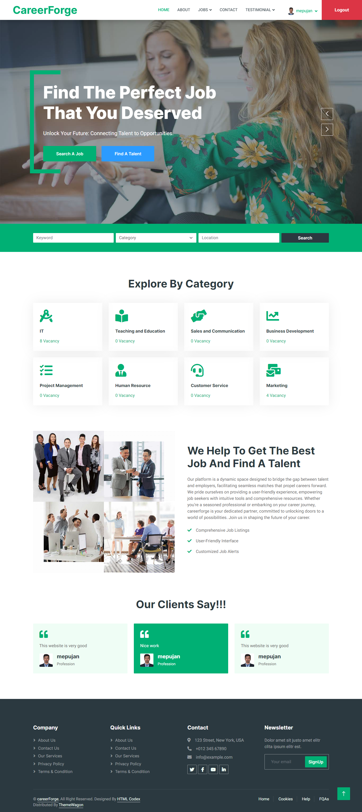
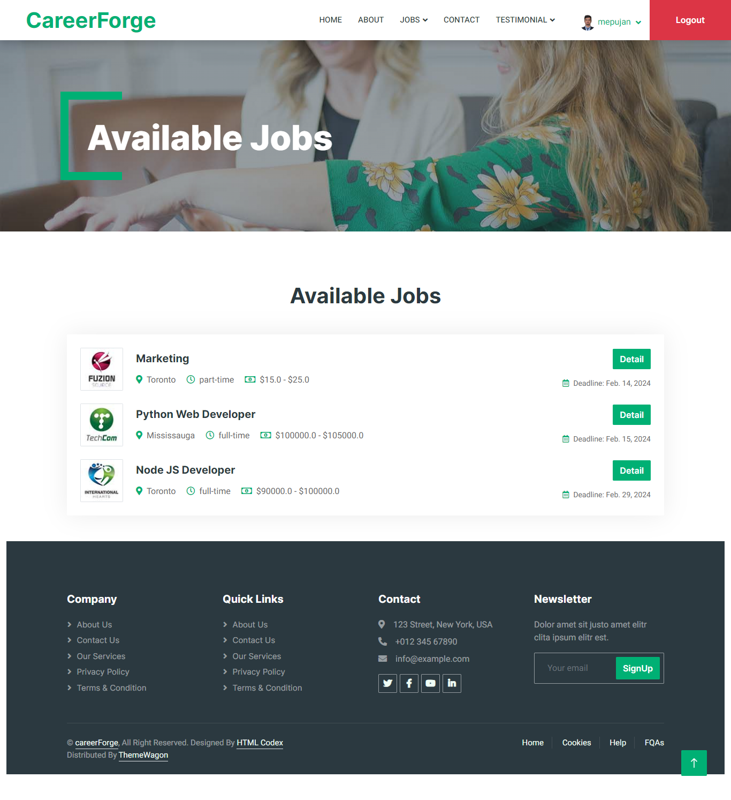
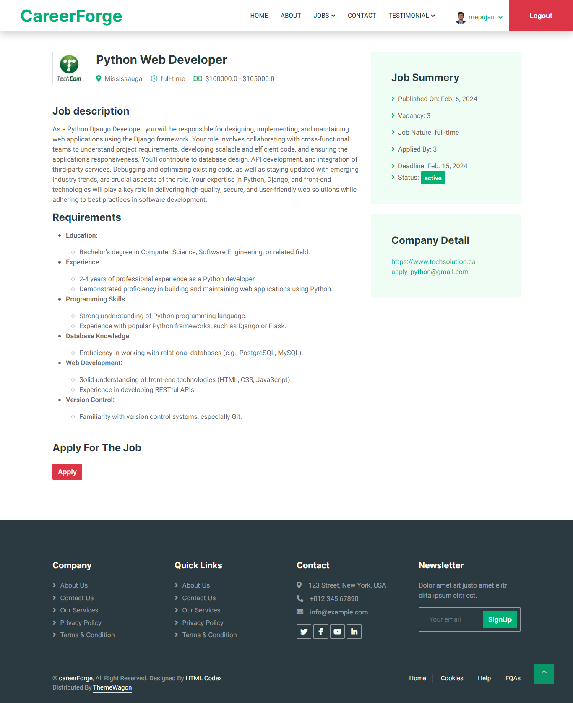

# CareerForge Web Application

Our Job Portal Web App aims to revolutionize the job-seeking and hiring process by providing
a user-friendly platform for both job seekers and employers. The app facilitates seamless job
search, application, and recruitment, enhancing efficiency and accessibility in the employment
landscape.
For job seekers, the platform offers advanced search filters, personalized recommendations,
and a streamlined application process. Users can create comprehensive profiles, upload
resumes, and track application statuses. The app also provides real-time notifications for
relevant job opportunities.
Employers benefit from a robust recruitment system that includes job posting, applicant
tracking, and candidate management tools. They can browse through a pool of qualified
candidates, schedule interviews, and communicate seamlessly with potential hires. The
platform employs AI-driven algorithms to match candidates with suitable job openings,
improving the hiring accuracy and reducing time-to-fill positions

## Feature Included

- JobSeeker and Employer Login/Signup.
- Apply for Job.
- Employer can post, view, update and delete their job.
- Email notification when job is applied.
- Search job as per keyword, location and job category.

## Technology Used

- Django
- AWS EC2
- Docker
- NGINX server

## Setting up the project

1. Clone the project using command:

   `git clone https://github.com/mepujan/careerForge.git`

2. Create virtual environment using command:
   - `python -m venv venv` (for windows)
   - `python3 -m venv venv` (for mac/linux)
3. Activate the virtual environment
   - For Windows: `venv/Scripts/activate`
   - For MAC/Linux: `source venv/bin/activate`
4. Install all the package required from `requirements.txt` file using command:

   `pip install -r requirements.txt`

5. Run the migrations command:
   - `python manage.py makemigrations`
   - `python manage.py migrate`
6. Create the superuser using command:
   - `python manage.py createsuperuser`
7. Run the server using command:

   `python manage.py runserver`

8. Run from docker compose using command:
   - `docker-compose up --build`
   - `docker-compose up -d --build` (To run in detach mode)

## Homepage

  

## Jobs Page

  

## Job Detail Page

  

